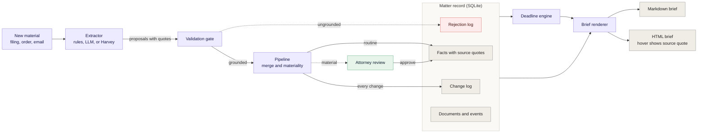

# Matter Intelligence Brief

**A legal matter brief that keeps itself current, with a source for every line and a lawyer in the loop for anything that matters.**

[](https://github.com/elyse-deq/matter-intelligence-brief/actions/workflows/ci.yml)


**Author:** [Elyse Dequina](https://elysedequina.org) &nbsp;|&nbsp; [Portfolio](https://elysedequina.org) &nbsp;|&nbsp; [GitHub](https://github.com/elyse-deq)


## The idea

Every time new material arrives on a matter (a filing, an order, an email), the brief updates:

```
Matter -> Key parties -> Important dates -> Documents -> Issues
       -> Outstanding requests -> Upcoming deadlines -> Recent activity
```

Lawyers do not need a summary that sounds right. They need one they can trust. So this project treats the brief as a **view of a validated record**, not as text a model rewrites:

- **The model is not the system of record.** Models propose changes. A structured record holds the truth.
- **No source, no fact.** Each proposal needs a verbatim quote from the document, and every date it carries must be written in that quote. Anything ungrounded is rejected and logged.
- **Deadlines are code.** The extractor captures a trigger date and a period. A deterministic engine computes the due date, including holidays and agreed extensions.
- **Humans approve what matters.** A new or moved deadline, or a new adverse party, waits for a lawyer before it reaches the brief.
- **Every brief opens with what changed.** Nothing rewrites itself silently.

## See it work

```bash
pip install -e ".[dev]"
matter-brief demo
```

The demo ingests seven synthetic documents one at a time and writes a brief after each: `output/brief_01.md` through `output/brief_07.md`, plus `output/brief.md` and `output/brief.html`.

Document 5 is an email in which opposing counsel asks for, and gets, a 14-day extension. The brief that follows opens with:

| Change | Status | Source |
| --- | --- | --- |
| Deadline moved: Responses to First Set of Requests for Production, Sep 11, 2026 (Fri) to Sep 25, 2026 (Fri) | approved | DOC-005 |

Then a third-party complaint arrives. The brief adds a new party, a new claim, and a new deadline:

| Due | Deadline | Status | Source |
| --- | --- | --- | --- |
| Oct 9, 2026 (Fri) | Third-party defendant's answer | Upcoming | DOC-007 |
| Jan 29, 2027 (Fri) | Fact discovery closes | Upcoming | DOC-003 |
| Feb 26, 2027 (Fri) | Expert disclosures | Upcoming | DOC-003 |
| Apr 16, 2027 (Fri) | Dispositive motions | Upcoming | DOC-003 |


In the HTML brief, hovering a row shows the exact passage the fact came from. More samples are in [`examples/`](examples/).

Try the review queue: `matter-brief demo --no-approve` leaves material changes pending instead of applying them.

## How it works

1. An **extractor** reads one document and proposes changes, each with a verbatim quote.
2. The **validation gate** rejects a proposal if its quote is not in the document, its dates are not stated in the quote, or required fields are missing.
3. Accepted proposals **merge** with the current state. A restated fact creates no change.
4. A **materiality check** sends new or moved deadlines, new or moved future dates, and new adverse parties to **attorney review**. Everything else applies immediately and stays in the change log.
5. The **brief** renders from the approved record, with due dates from the deadline engine.

Details, the record schema, and the materiality policy are in [docs/architecture.md](docs/architecture.md).

## Architecture



Solid lines are the normal path. Dotted lines are the exceptions: ungrounded output goes to the rejection log, and material changes wait for attorney review. GitHub renders this diagram, and you can zoom and pan it.

## Use a real model

The rules extractor keeps the demo runnable without a model. For real documents, use the LLM extractor. It passes through the same validation gate, so a hallucinated fact is rejected and logged.

```bash
# Local model: documents never leave the machine
matter-brief init --matter-id demo --name "Demo matter"
matter-brief ingest --matter-id demo --file order.txt --doc-id DOC-1 --title "Order" \
    --type "Court order" --received 2026-09-18 --extractor llm --provider ollama

# Hosted model
export ANTHROPIC_API_KEY=...
matter-brief ingest ... --extractor llm --provider anthropic

matter-brief review --matter-id demo                   # list pending changes
matter-brief review --matter-id demo --approve all
matter-brief brief  --matter-id demo --format html --out brief.html
```

Compare models on the same labeled set with `python -m eval.run_eval --extractor llm --provider ollama`. The LLM path is covered by tests using a stub model, including a test that fabricated quotes and wrong dates are rejected. It has not been run against a live model in this repository, so run the eval before trusting it.

## Harvey and other legal AI platforms

An extractor is an interface. A firm's existing platform can do the extraction step while this pipeline provides the record, the validation, the review queue, and the brief. [`extractors/harvey_stub.py`](src/matter_brief/extractors/harvey_stub.py) lists what to confirm before building that adapter. [docs/production-notes.md](docs/production-notes.md) covers sources, permissions, ethical walls, and a pilot shape.

## Project layout

```
src/matter_brief/
  extractors/      rules (demo), llm (Anthropic or Ollama), harvey_stub
  validate.py      the grounding gate
  pipeline.py      ingest, merge, materiality
  deadlines.py     deterministic date math
  store.py         SQLite record, change log, rejection log
  brief.py         Markdown and HTML rendering
  cli.py           demo, init, ingest, review, brief
data/synthetic_matter/   seven fictional documents
eval/                    gold labels and scoring
tests/                   deadlines, validation, pipeline, LLM, brief
docs/                    architecture, principles, production notes, diagrams
```

## Limitations

- All demo data is synthetic and every party is fictional.
- The rules extractor is written against the demo documents. Its perfect score shows the eval harness works, not that extraction is solved.
- Deadline rules are a simplified illustration (US federal holidays, roll to the next business day). Real deadlines depend on the court and the governing rules, and a lawyer must verify them.
- The brief is decision support for a docketing and review process. It is not legal advice and does not replace either.

## Roadmap

- Matter-level permissions and ethical-wall filtering
- Connectors for document management, email, and dockets
- Contradiction detection across documents
- A portfolio view of upcoming deadlines across matters
- Word and Teams delivery of the brief

## Author

**Elyse Dequina** designs and builds AI workflows across legal operations and business systems.

- Portfolio: [elysedequina.org](https://elysedequina.org)
- GitHub: [@elyse-deq](https://github.com/elyse-deq)

Feedback and ideas are welcome. Open an issue or reach out through the portfolio site.

## License

MIT. See [LICENSE](LICENSE).
