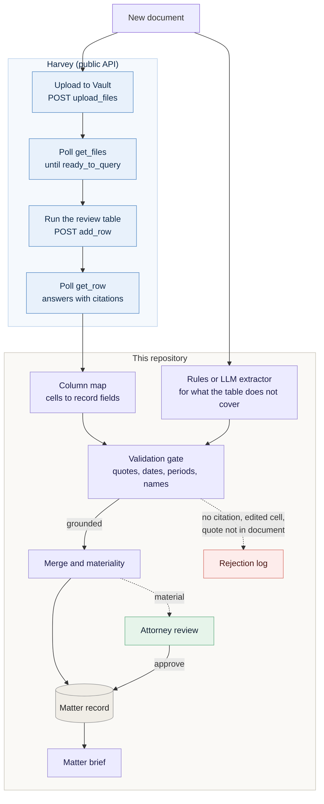

# Where Harvey fits

Harvey fills one slot: **extraction**. It reads a document and answers a fixed set of questions in a Vault review table. This repository turns those answers into proposals, validates them against the document, and does everything after that: the matter record, the change log, deadline math, attorney review, and the brief.



## What Harvey's public documentation confirms

Checked against Harvey's public developer documentation (developers.harvey.ai) and public security pages on September 21, 2026. None of this has been run against a live Harvey workspace.

| Question | Answer | Evidence and caveats |
| --- | --- | --- |
| Can Vault and review table outputs be exported or reached by API? | **Yes** | Documented endpoints upload files, poll processing status, add rows to a review table, and read a row's cells. Bearer token auth. Vault and review table endpoints are limited to 10 requests per minute. The token needs the `Vault API` permission, and API access has to be enabled on the workspace by Harvey. |
| Can Workflow Builder workflows be run or read by API? | **Not documented** | The public developer index lists Vault, review tables, the Completion API, history and audit exports, client matters, and an MCP server. It lists no endpoint for running a workflow or reading a workflow's output. In the app, workflow outputs can be exported as Word, Excel, or PowerPoint files. |
| Can a new document trigger a workflow? | **Not documented** | No webhook or event trigger appears in the public docs. Harvey advertises syncing from iManage, SharePoint, and Google Drive into Vault, but the docs do not say whether a sync emits an event. The workable pattern is that **this pipeline pushes**: upload, wait for `ready_to_query`, add a row, poll the row. |
| Does each extracted value come with the source passage? | **Yes, with caveats** | Each review table cell has a `summary`, the reasoning, and a `citations` array with a page number and a `citation_quote`. Caveats below. |
| What are the data handling and retention terms? | **Partly public** | Harvey states that it does not train on customer data, that its model providers are held to zero data retention (feature-specific exceptions exist, are off by default, and can only be enabled by account administrators), that customers set retention policies and can delete data, and that data can stay in-region (EU or Switzerland, US, Australia). It states that it syncs and enforces a firm's ethical walls. Vault deletion is not instant: a deleted vault goes to a recycle bin first. **Not found in the public pages:** post-termination deletion timelines, the sub-processor list, and the terms of any specific pilot. Get those in writing. |

Harvey also offers a hosted MCP server (`ask_about_vault`, `list_vault_projects`, and others) for assistants such as Claude. That is a lawyer-facing question-and-answer surface. It is not part of this pipeline, and it does not return the structured, cited rows that the pipeline needs.

## The citation caveats, and how the gate handles them

| What Harvey's API does | What happens here |
| --- | --- |
| A cell a person edited returns their value, and the example shows an empty `citations` list | Rejected as "missing quote" and logged. Edited cells need a source passage attached before they can enter the record. |
| Citation quotes can be cut off mid-sentence (the public example has quotes that stop mid-word) | Accepted. A truncated quote is still a verbatim prefix of a passage in the document. |
| `summary` is free text such as "February 7, 2011", not an ISO date | Parsed by the adapter. If it cannot be parsed, the raw text is passed on and rejected as "not an ISO date". Nothing is guessed. |
| The quote comes from Harvey's text extraction, which can differ from ours | Rejected if it is not found in our copy of the document. Expect this with scanned PDFs, and test with real documents in the pilot. |
| One fact may need several cells (a service date in one, a period in another) | Assembled into one proposal. The other cells' passages become `supporting_quotes`, and each must also be found in the document. One uncited cell blocks the whole deadline. |
| A cell answers "Not found" | Skipped. |

## Try it offline

```bash
matter-brief demo --extractor harvey-sample
```

This runs the matter with **synthetic Harvey-style rows** (`data/harvey_sample/`) for the scheduling order, the first requests for production, and the third-party complaint, and rules for everything else. The table only covers the questions it has columns for, so the rules extractor fills in what it does not, such as the third-party claim. The demo prints which extractor handled each document.

The sample rows follow the documented `get_row` shape but are **assumed, not exported from a real workspace**, and the column names are invented.

## Run it against a real workspace

```bash
export HARVEY_API_KEY=...
matter-brief ingest --matter-id demo --file order.txt --doc-id DOC-1 --title "Order" \
    --type "Court order" --received 2026-09-18 \
    --extractor harvey --harvey-project <vault-project-id> \
    --harvey-review-table <review-table-id> --harvey-column-map my_columns.json
```

1. Create a Vault project and a review table whose columns match your column map. The table is where the firm's questions live.
2. Write a column map (see `data/harvey_sample/column_map.json`) from your column names to record fields.
3. Run one document and read the rejection log before trusting anything.

The live client is written from the public docs and tested against a fake transport only. Expect to adjust it once it meets the real API. One inconsistency in the docs: the review table guide passes `ids=` to `get_files` while the API reference documents `file_ids=`. The client uses the API reference.

## Questions to put to Harvey before a pilot

1. Is API access enabled for our workspace and region, and which permissions does our token need?
2. Can a workflow or review table run be started by an event, or is polling the only option?
3. How is the citation text produced for scanned or image-only documents, and how closely does it match the original text?
4. What are the retention and deletion terms for uploaded files, extracted answers, and the recycle bin, and what happens at contract end?
5. Which sub-processors handle our data, and in which regions?
6. Is there a higher rate limit than 10 requests per minute for a matter-by-matter pipeline?

## One more decision: where the text lives

This repository stores each document's text in its own SQLite database so the validation gate can check quotes. If a firm sends documents to Harvey, decide whether a second copy of the text in this store is acceptable, where it is encrypted and retained, and who can read it. For the most sensitive matters, a local extractor may be the better fit.
