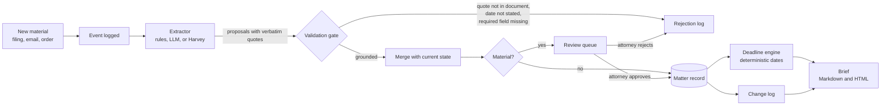

# Architecture

The brief is a **view over a structured matter record**. It is never rewritten from scratch by a model. New material changes the record, and the brief is re-rendered from the record.

## Components

| Module | Job |
| --- | --- |
| `extractors/` | Turn one document into proposed changes. They only propose. They never write, never compute dates, never decide materiality. |
| `validate.py` | The gate. A proposal needs a verbatim quote found in the document, and every date it carries must be written in that quote. |
| `pipeline.py` | Runs extract, validate, merge, materiality, and record. Decides what waits for review. |
| `store.py` | SQLite. Holds documents, events, the approved facts, every proposed change with before and after, and every rejection. |
| `deadlines.py` | Date arithmetic, holiday roll-forward, and agreed extensions. No model is involved. |
| `brief.py` | Builds the sections from approved facts and renders Markdown or HTML. |

## The record

Five kinds of fact, each keyed so a later document can update the same item:

| Kind | Example key | Example fields |
| --- | --- | --- |
| `party` | `party-defendant`, `counsel-plaintiff` | name, role |
| `date` | `trial`, `complaint-filed` | label, date |
| `issue` | `count-i`, `defense-2` | label, side |
| `request` | `rfp-set-1` | label, served_by, served_on, service_date, status |
| `deadline` | `rfp-set-1-response` | label, status, and either `date` or `trigger_date` + `days` |

Every applied change stores the source document id and the quoted passage, so any line in the brief can be traced back to the words that support it.

## What counts as material

Material changes wait for a lawyer. Everything else is applied and stays visible in the change log.

- A new deadline, or a deadline whose computed due date moves (an agreed extension, for example)
- A new future date, or a date that moves
- A new adverse party joining a matter that already has parties

Issues, counsel, status changes such as "responded", and historical dates are applied immediately. Change this policy in `pipeline.is_material`. It is the most important dial in the system.

## Idempotence

Ingesting the same document twice does nothing (matched by id and content hash). A document that restates a known fact creates no change. Extensions accumulate through `add_extension_days`, so two separate extensions add up rather than overwrite.

## Known limitations

- Approving pending changes out of order can leave an earlier change unapplied while a later one, which already carries the merged state, is applied. Approve in order, or approve all.
- One matter per record. There is no cross-matter view yet.
- Deadline rules are a simplified illustration. Real deadlines depend on the court, the rule set, and how service was made.
